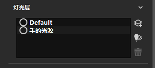
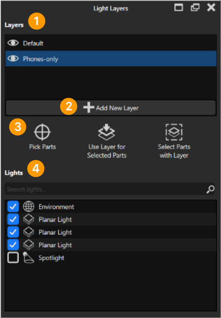

# 灯光层

该板块是新增命令，支持的版本：

**该板块的目的：**
单独对场景中某一个或多个部件进行独立打光。该板块支持的灯光有：环境，以及软件自带的各类区域光，聚光灯，点光等物体。

如图；

①是灯光图层板块。

②添加新的灯光图层，可以新增图层，来对各个部件进行灯光控制，一个图层控制可以一个或者多个部件。

③选择部件

| 选取部件 | 使用图层给选择的部件 |   使用图层给选择的部件 |
| ------- | ------- | ------- |
|     1    | 2        |    3      |

